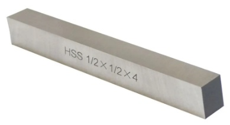
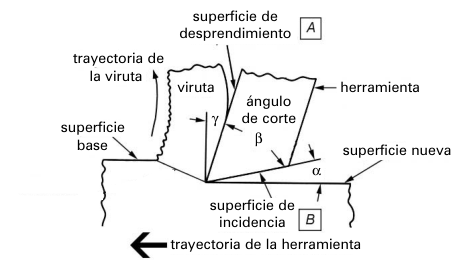
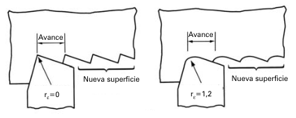
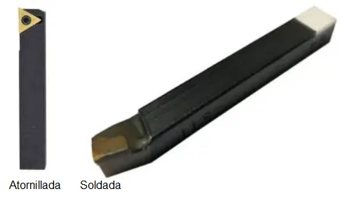

<!-- *** GUIDE START *** -->

## La más común en nuestro taller

::: figure
{width=300px}

<small>Barra de HSS de 1/2" de sección por 3" de largo</small>
:::

En el taller utilizamos una herramienta de **acero rápido (HSS)** (high speed steel), en forma de barra que se afila para darle la forma necesaria.

En el comercio suelen nombrarla también como "Bits HSS" que viene de *HSS tool bit o HSS cutting tool bit* (barra de corte de acero rápido). Suelen tener un porcentaje importante de cobalto (5-10%), que le aporta dureza en caliente, y por eso "cobalto" también suele aparecer en los nombres comerciales.

## Geometría básica

::: figure
{width=400px}

<small>(Fuente: Ginjaume-Torre)</small>
:::

La herramienta tiene:

* **Filo principal:** realiza la mayor parte del corte.
* **Filo secundario:** interviene en la formación de la superficie.
* **Punta:** unión de ambos filos.

Los principales elementos de su geometría son:

* **Ángulo de incidencia:** evita que la herramienta roce contra la pieza.
* **Ángulo de desprendimiento:** facilita la salida de la viruta.
* **Radio de punta:** redondeo de la punta que influye en la resistencia del filo y en el acabado.

## Desbaste y acabado

**Desbaste:** se busca quitar mucho material. La herramienta debe tener un filo resistente y soportar pasadas más profundas.

**Acabado:** se busca obtener la medida final y una buena superficie. Se utilizan pasadas pequeñas y una punta con **mayor radio o redondeo**, que permite obtener una superficie más uniforme.

Con un mismo avance la herramienta con la punta más redondeada deja una superficie más uniforme.

::: figure
{width=400px}

<small>(Fuente: Ginjaume-Torre)</small>
:::

## Plaquitas de metal duro

::: figure
{width=400px}

:::

Las **plaquitas de metal duro** son elementos de corte fabricados con un material muy duro. Algunas son intercambiables y se atornillan en un portaherramientas y otras se sueldan en un vástago.

Sus principales ventajas son:

* permiten trabajar a **mayores velocidades de corte**;
* tienen buena resistencia al desgaste;
* proporcionan un corte y una terminación muy uniformes.

Como desventaja, son **más frágiles frente a golpes** que una herramienta HSS.

## Actividad

Prepara una exposición oral de 2 minutos de duración como máximo explicando el contenido de esta guía. Debes presentar también un dibujo de perfil de la herramienta en donde se aprecie cláramente los ángulos de incidencia y de desprendimiento. 

## Sentido de corte

La misma herramienta puede utilizarse para cilindrar y refrentar, pero su geometría está pensada para trabajar principalmente en un determinado sentido de avance.

En nuestro caso:

**contrapunto → plato**

Aunque puede producir algo de corte al regresar, no es el sentido para el cual está optimizada.

<!-- *** GUIDE END *** -->

<!-- *** GUIDE AUXILIARY THINGS *** -->

<!--

● Sections: example, activity. solutions, figure, warning, note

::: example
### Ejemplo: Cálculo de derivadas
Aquí va el contenido de tu ejemplo. Puedes usar Markdown normal adentro.
:::

● Image:

::: figure
{width=400px}

<small>Pie (Source)</small>
:::

[⌕](../../images/ ) 

● Videos:

 Change XXX to video-id and put time in seconds

 - Yotube with start point: [Mira este momento clave en el video](https://www.youtube.com/watch?v=XXX&t=123s)

 - Youtubetrimmer with start and end point: [Mirá este momento puntual del video](https://youtubetrimmer.com/view/?v=XXX&start=120&end=150&loop=0)

-->
