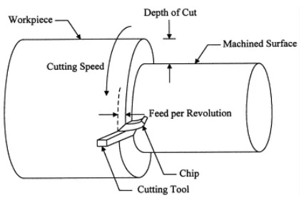
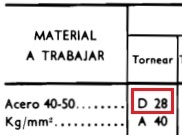

<!-- *** GUIDE START *** -->

::: figure
{width=400px}

<small>Parámetros básicos del mecanizado</small>
:::

Son valores que permiten definir cómo trabaja una herramienta sobre una pieza. Los cuatro más básicos son:

* **RPM:** velocidad de giro de la pieza o del husillo.
* **Velocidad de corte:** velocidad con la que el material pasa frente al filo.
* **Avance:** velocidad con la que la herramienta se desplaza sobre la pieza.
* **Profundidad de corte:** cuánto material se elimina en cada pasada.

La elección adecuada de estos parámetros permite trabajar de manera **segura**, obtener una **buena terminación** y evitar el desgaste excesivo de la herramienta.

### Velocidad de corte $V_c$

Indica qué tan rápido se mueve la superficie de la pieza respecto del filo de la herramienta.

Se expresa normalmente en **metros por minuto**:

$$
V_c = \frac{\pi \cdot D \cdot n}{1000}
$$

donde:

* $V_c$ = velocidad de corte en m/min
* $D$ = diámetro de la pieza en mm
* $n$ = RPM

::: example

Por ejemplo, si una pieza tiene un diámetro de $50$ mm y gira a $600$ RPM:

$V_c = \frac{\pi \cdot 50 \cdot 600}{1000}$

$V_c \approx 94,2\text{ m/min}$

:::

Es habitual que la velocidad de corte sea un dato de manual o del fabricante de la herramienta. Por ejemplo el tradicional manual Casillas tiene dos tablas que indican la velocidad de corte para una herramienta de acero rápido, tanto para desvaste como para acabado (pag. 590 y 591):

- Para aceros: [⌕](../../images/tp5/lathe-vel-casillas-steels.jpg) 
- Para aceros: [⌕](../../images/tp5/lathe-vel-casillas-others.jpg) 

::: example

Ejemplo:

¿Cuál es la velocidad de corte para del desvaste para el eje escalonado de acero SAE 1020 que estás haciendo?

- Para un SAE 1020 se puede tomar como referencia aproximada una resistencia a la tracción de 40–50 kg/mm²
- Como se ve abajo, a este acero le corresponde una velocidad de corte para el desvaste "D" de **28 m/min**

::: figure

:::

:::

### RPM

Las **RPM (revoluciones por minuto)** indican cuántas vueltas realiza el husillo en un minuto.

En un torno convencional, las RPM pueden seleccionarse mediante las velocidades disponibles en la máquina.

Habitualmente se selecciona a partir de la velocidad de corte y despejando "n" de la fórmula de la velocidad de corte.

::: example

Ejemplo:

¿Cuántas rpm se necesitan para desvastar el eje escalonado si el diámetro es 20 mm?

- Del punto anterior: $V_c=28 m/min$
- Despejando "n" de la fórmula de $V_c$:

$n = \frac{V_c \cdot 1000}{\pi \cdot D}$

$n = \frac{28 \cdot 1000}{\pi \cdot 20}$ = **445.8 rpm**

**Se debe seleccionar en el torno las rpm más cercana**

:::

### Avance y profundidad de corte

El **avance** es el desplazamiento de la herramienta mientras se realiza el corte. En tornería puede expresarse como **milímetros por revolución** o en **milímetros por minuto**

La **profundidad de corte** indica cuánto material se elimina en una pasada. Tener en cuenta que si la herramienta penetra 1 mm el diámetro se reduce 2 mm como se aprecia abajo. El tambor graduado del volante está calibrado para indicar la reducción del diámetro: en este caso 2 mm. Es lo que se grafica abajo.

::: figure

:::

### Actividad

::: activity

**1)** Dibujar la figura inicial de esta guía que muestra los parámetros básicos del mecanizado pero poniendo el texto en español.

**2)** Según el manual Casillas, para herramientas de acero rápido ¿cual sería el valor de la velocidad de corte para el eje escalonado para la operación de desvaste y acabado? Como el material de partida tiene un diámetro de 22 y el menor diámetro al que se llega es de 10 mm ¿cuáles son las rpm para estos dos valores para las velocidades de corte tanto de desvaste como de acabado? Haz los cálculos y debes poder explicar al profesor lo que hiciste.

**3)** Repetir los cálculos del punto 1 si el material fuera aluminio.

**4)** Explicar oralmente, no hace falta ponerlo por escrito: Avance y profundidad de corte.

:::
<!-- *** GUIDE END *** -->

<!-- *** GUIDE AUXILIARY THINGS *** -->

<!--

● Sections: example, activity. solutions, figure, warning, note

::: example
### Ejemplo: Cálculo de derivadas
Aquí va el contenido de tu ejemplo. Puedes usar Markdown normal adentro.
:::

● Image:

::: figure
{width=400px}

<small>Pie (Source)</small>
:::

[⌕](../../images/ ) 

● Videos:

 Change XXX to video-id and put time in seconds

 - Yotube with start point: [Mira este momento clave en el video](https://www.youtube.com/watch?v=XXX&t=123s)

 - Youtubetrimmer with start and end point: [Mirá este momento puntual del video](https://youtubetrimmer.com/view/?v=XXX&start=120&end=150&loop=0)

-->
