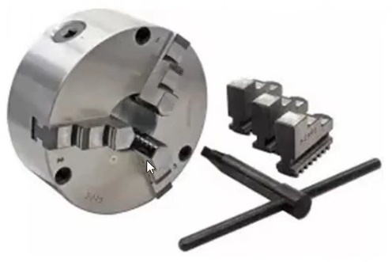

<!-- *** GUIDE START *** -->

::: figure
{width=400px}

<small>Plato con mordazas de recambio para sujetar por el interior</small>
:::

## Tipos de sujección más comunes

El primer paso antes de mecanizar es fijar correctamente la pieza en el torno. Esto depende de la forma, tamaño y tipo de operación que se va a realizar.

* **Plato de 3 mordazas [⌕](../../images/tp5/sujeccion_plato_3mordazas.jpg):**

   + Permite sujetar rápidamente piezas cilíndricas o hexagonales. Las tres mordazas se desplazan simultáneamente y centran la pieza aproximadamente respecto del eje del torno.
   + **Voladizo de la pieza:** Es la parte de la pieza que sobresale del plato. Cuanto mayor sea el voladizo, mayor es la posibilidad de que la pieza flexione o vibre durante el mecanizado. Por eso conviene trabajar con el menor voladizo posible.
   + En la figura puedes ver como también puedes invertir las mordazas para sujetar piezas de mayor diámetro.
* **Plato + contrapunto [⌕](../../images/tp5/sujeccion_plato_punto.jpg):** combina la sujeción del plato con el apoyo del contrapunto. Es una alternativa muy habitual para piezas largas. En la imagen puedes ver también una mecha de centro usada para hacer un orificio cónico en la pieza en donde se coloca el punto. Si el punto no es giratorio hay que poner grasa en su punta disminuir la fricción con la pieza.
* **Plato de 4 mordazas independientes [⌕](../../images/tp5/sujeccion_plato_4mordazas.jpg):** cada mordaza se regula por separado. Permite sujetar piezas cuadradas, irregulares o descentrarlas intencionalmente. Requiere realizar el centrado manualmente. En la figura se observa un torneado excéntrico (descentrada).  
* **Entre puntos [⌕](../../images/tp5/sujeccion_entre_puntos.jpg):** la pieza se sostiene entre el plato de arrastre  y el contrapunto. Se usa una brida de arrastre para hacer que la pieza gire. Es apropiado para ejes largos y permite mecanizar gran parte de su longitud con gran concentricidad.
* **Luneta [⌕](../../images/tp5/sujeccion_luneta.jpg):** sirve como apoyo intermedio en piezas largas y delgadas, evitando que se flexionen o vibren durante el mecanizado.

## Otras cuestiones relacionadas

**Centrado y comprobación:** antes de mecanizar hay que verificar que la pieza esté correctamente posicionada y que no haya interferencias. Cuando hay que centrar o descentrar la pieza para trabajos de precisión se usa un comparador de reloj. 

**Seguridad:** una pieza mal sujetada puede desplazarse, vibrar, dañar la herramienta o salir despedida. La llave del plato debe retirarse siempre antes de poner el torno en marcha.

## Actividades

::: activity

**1)** Observa este fragmento de [video](https://www.youtubetrimmer.com/view/?v=5qmi_fE-w18&start=222&end=380&loop=1) y responde estas preguntas:

- ¿De qué tipo de plato se trata aquí? ¿Las mordazas se mueven todas juntas (al mismo tiempo) o son independientes?
- ¿Básicamente que hace para desplazar un poquito la pieza hacia un lado?

**2)** Prepara una breve exposición explicando los distintos tipos de sujección que hemos visto hasta aquí. Hay que exponerla al profesor para aprobar esta guía.

:::

<!-- *** GUIDE END *** -->

<!-- *** GUIDE AUXILIARY THINGS *** -->

<!--

● Sections: example, activity. solutions, figure, warning, note

::: example
### Ejemplo: Cálculo de derivadas
Aquí va el contenido de tu ejemplo. Puedes usar Markdown normal adentro.
:::

● Image:

::: figure
{width=400px}

<small>Pie (Source)</small>
:::

[⌕](../../images/ ) 

● Videos:

 Change XXX to video-id and put time in seconds

 - Yotube with start point: [Mira este momento clave en el video](https://www.youtube.com/watch?v=XXX&t=123s)

 - Youtubetrimmer with start and end point: [Mirá este momento puntual del video](https://youtubetrimmer.com/view/?v=XXX&start=120&end=150&loop=0)

-->
